# User Flow (사용자 흐름도)

> **프로젝트명:** 팀메이트
> **버전:** v1.0
> **작성일:** 2025-01-28

---

## 1. 전체 서비스 흐름

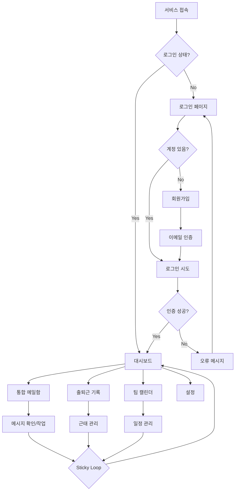
```mermaid
graph TD
    A[서비스 접속] --> B{로그인 상태?}
    B -->|No| C[로그인 페이지]
    B -->|Yes| D[대시보드]

    C --> E{계정 있음?}
    E -->|No| F[회원가입]
    E -->|Yes| G[로그인 시도]

    F --> H[이메일 인증]
    H --> G
    G --> I{인증 성공?}
    I -->|No| J[오류 메시지]
    J --> C
    I -->|Yes| D

    D --> K[통합 메일함]
    D --> L[출퇴근 기록]
    D --> M[팀 캘린더]
    D --> N[설정]

    K --> O[메시지 확인/작업]
    L --> P[근태 관리]
    M --> Q[일정 관리]

    O --> R{Sticky Loop}
    P --> R
    Q --> R
    R --> D
```

---

## 2. 인증 흐름

### 2.1 회원가입 흐름

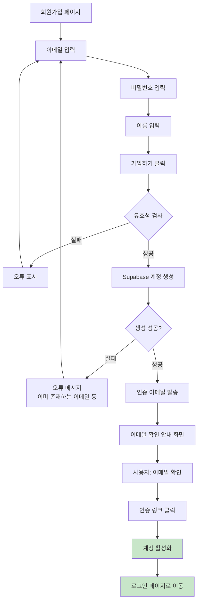
```mermaid
graph TD
    A[회원가입 페이지] --> B[이메일 입력]
    B --> C[비밀번호 입력]
    C --> D[이름 입력]
    D --> E[가입하기 클릭]

    E --> F{유효성 검사}
    F -->|실패| G[오류 표시]
    G --> B

    F -->|성공| H[Supabase 계정 생성]
    H --> I{생성 성공?}
    I -->|실패| J[오류 메시지<br/>이미 존재하는 이메일 등]
    J --> B

    I -->|성공| K[인증 이메일 발송]
    K --> L[이메일 확인 안내 화면]
    L --> M[사용자: 이메일 확인]
    M --> N[인증 링크 클릭]
    N --> O[계정 활성화]
    O --> P[로그인 페이지로 이동]

    style O fill:#c8e6c9
    style P fill:#c8e6c9
```

### 2.2 로그인 흐름

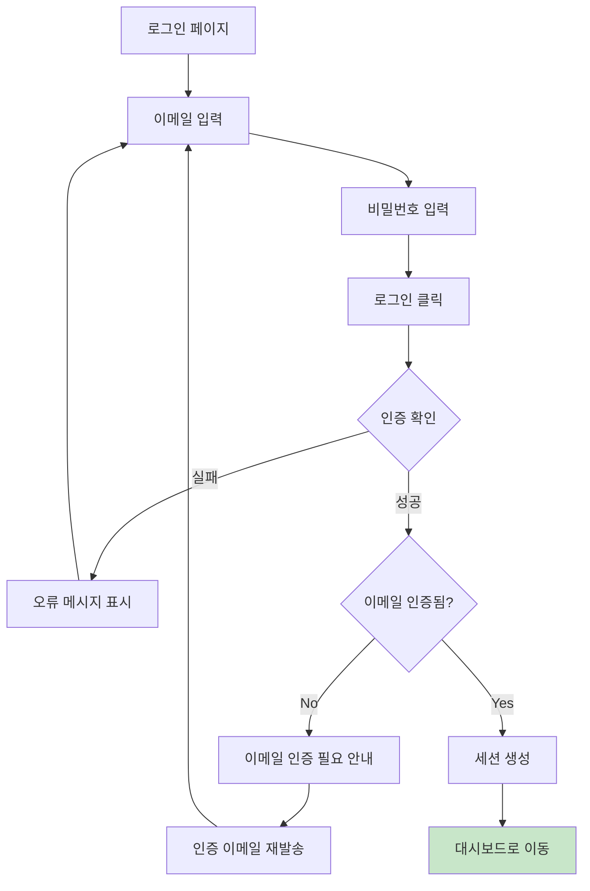
```mermaid
graph TD
    A[로그인 페이지] --> B[이메일 입력]
    B --> C[비밀번호 입력]
    C --> D[로그인 클릭]

    D --> E{인증 확인}
    E -->|실패| F[오류 메시지 표시]
    F --> B

    E -->|성공| G{이메일 인증됨?}
    G -->|No| H[이메일 인증 필요 안내]
    H --> I[인증 이메일 재발송]
    I --> B

    G -->|Yes| J[세션 생성]
    J --> K[대시보드로 이동]

    style K fill:#c8e6c9
```

### 2.3 로그아웃 흐름

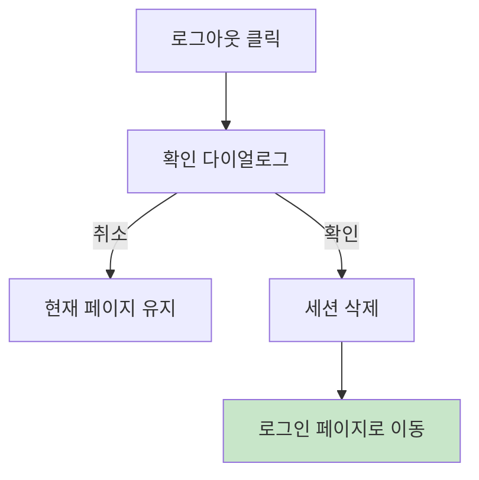
```mermaid
graph TD
    A[로그아웃 클릭] --> B[확인 다이얼로그]
    B -->|취소| C[현재 페이지 유지]
    B -->|확인| D[세션 삭제]
    D --> E[로그인 페이지로 이동]

    style E fill:#c8e6c9
```

---

## 3. FEAT-1: 통합 메일함 흐름 (MVP)

### 3.1 메시지 목록 조회

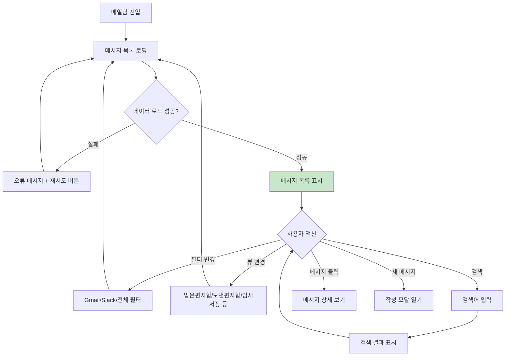
```mermaid
graph TD
    A[메일함 진입] --> B[메시지 목록 로딩]
    B --> C{데이터 로드 성공?}
    C -->|실패| D[오류 메시지 + 재시도 버튼]
    D --> B

    C -->|성공| E[메시지 목록 표시]
    E --> F{사용자 액션}

    F -->|필터 변경| G[Gmail/Slack/전체 필터]
    G --> B

    F -->|뷰 변경| H[받은편지함/보낸편지함/임시저장 등]
    H --> B

    F -->|검색| I[검색어 입력]
    I --> J[검색 결과 표시]
    J --> F

    F -->|메시지 클릭| K[메시지 상세 보기]
    F -->|새 메시지| L[작성 모달 열기]

    style E fill:#c8e6c9
```

### 3.2 메시지 상세 조회

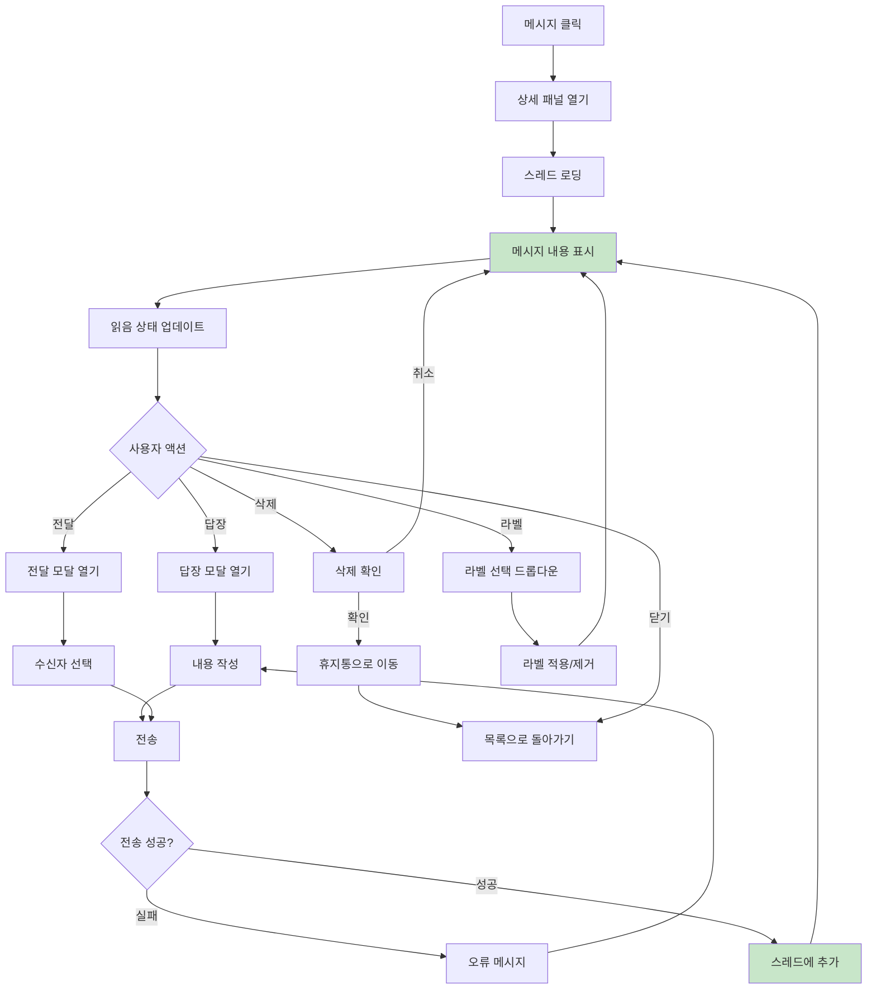
```mermaid
graph TD
    A[메시지 클릭] --> B[상세 패널 열기]
    B --> C[스레드 로딩]
    C --> D[메시지 내용 표시]
    D --> E[읽음 상태 업데이트]

    E --> F{사용자 액션}

    F -->|답장| G[답장 모달 열기]
    G --> H[내용 작성]
    H --> I[전송]
    I --> J{전송 성공?}
    J -->|실패| K[오류 메시지]
    K --> H
    J -->|성공| L[스레드에 추가]
    L --> D

    F -->|전달| M[전달 모달 열기]
    M --> N[수신자 선택]
    N --> I

    F -->|삭제| O[삭제 확인]
    O -->|취소| D
    O -->|확인| P[휴지통으로 이동]
    P --> Q[목록으로 돌아가기]

    F -->|라벨| R[라벨 선택 드롭다운]
    R --> S[라벨 적용/제거]
    S --> D

    F -->|닫기| Q

    style D fill:#c8e6c9
    style L fill:#c8e6c9
```

### 3.3 메시지 작성

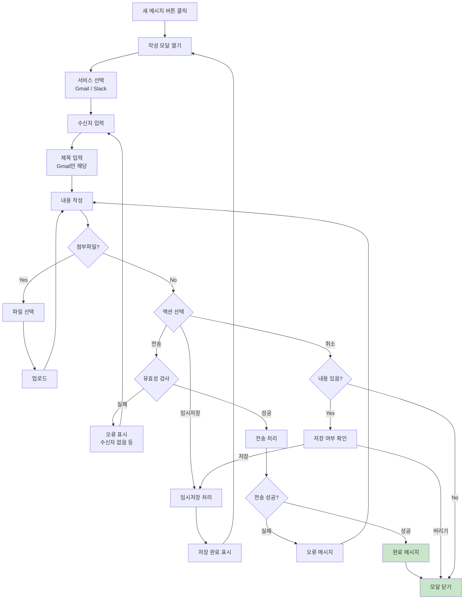
```mermaid
graph TD
    A[새 메시지 버튼 클릭] --> B[작성 모달 열기]
    B --> C[서비스 선택<br/>Gmail / Slack]
    C --> D[수신자 입력]
    D --> E[제목 입력<br/>Gmail만 해당]
    E --> F[내용 작성]

    F --> G{첨부파일?}
    G -->|Yes| H[파일 선택]
    H --> I[업로드]
    I --> F
    G -->|No| J{액션 선택}

    J -->|임시저장| K[임시저장 처리]
    K --> L[저장 완료 표시]
    L --> B

    J -->|전송| M{유효성 검사}
    M -->|실패| N[오류 표시<br/>수신자 없음 등]
    N --> D

    M -->|성공| O[전송 처리]
    O --> P{전송 성공?}
    P -->|실패| Q[오류 메시지]
    Q --> F
    P -->|성공| R[완료 메시지]
    R --> S[모달 닫기]

    J -->|취소| T{내용 있음?}
    T -->|Yes| U[저장 여부 확인]
    U -->|저장| K
    U -->|버리기| S
    T -->|No| S

    style R fill:#c8e6c9
    style S fill:#c8e6c9
```

### 3.4 라벨 관리

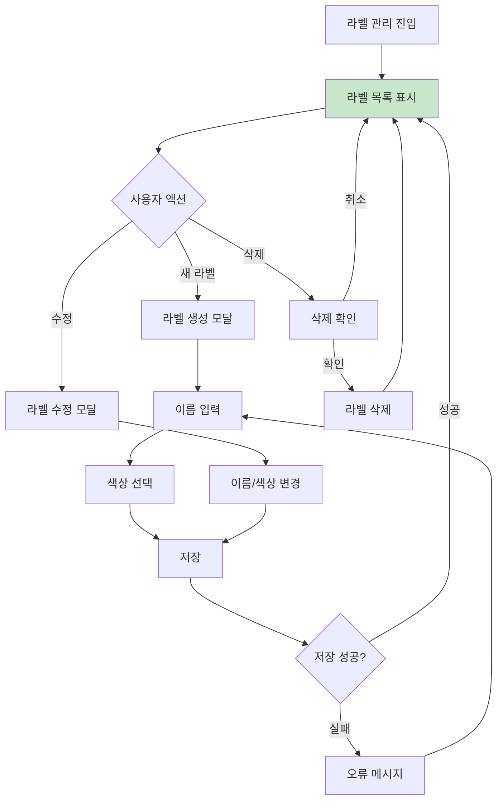
```mermaid
graph TD
    A[라벨 관리 진입] --> B[라벨 목록 표시]

    B --> C{사용자 액션}

    C -->|새 라벨| D[라벨 생성 모달]
    D --> E[이름 입력]
    E --> F[색상 선택]
    F --> G[저장]
    G --> H{저장 성공?}
    H -->|실패| I[오류 메시지]
    I --> E
    H -->|성공| B

    C -->|수정| J[라벨 수정 모달]
    J --> K[이름/색상 변경]
    K --> G

    C -->|삭제| L[삭제 확인]
    L -->|취소| B
    L -->|확인| M[라벨 삭제]
    M --> B

    style B fill:#c8e6c9
```

### 3.5 일괄 작업

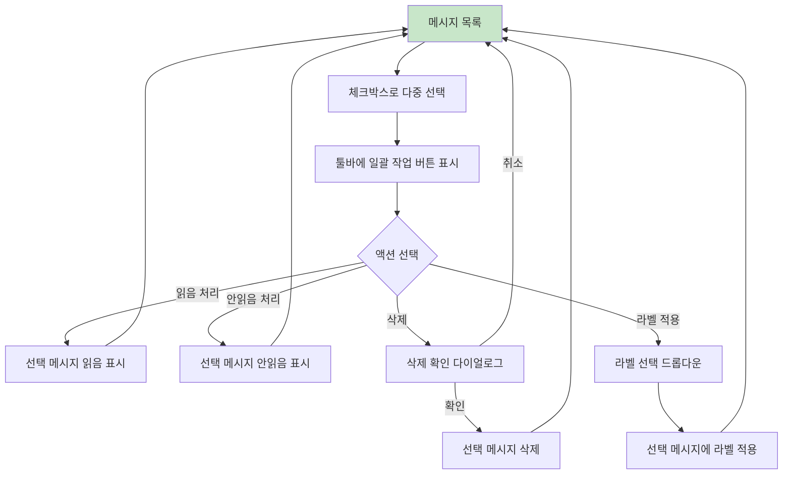
```mermaid
graph TD
    A[메시지 목록] --> B[체크박스로 다중 선택]
    B --> C[툴바에 일괄 작업 버튼 표시]

    C --> D{액션 선택}

    D -->|읽음 처리| E[선택 메시지 읽음 표시]
    E --> A

    D -->|안읽음 처리| F[선택 메시지 안읽음 표시]
    F --> A

    D -->|삭제| G[삭제 확인 다이얼로그]
    G -->|취소| A
    G -->|확인| H[선택 메시지 삭제]
    H --> A

    D -->|라벨 적용| I[라벨 선택 드롭다운]
    I --> J[선택 메시지에 라벨 적용]
    J --> A

    style A fill:#c8e6c9
```

---

## 4. FEAT-2: 출퇴근/근태 관리 흐름

### 4.1 출근 기록

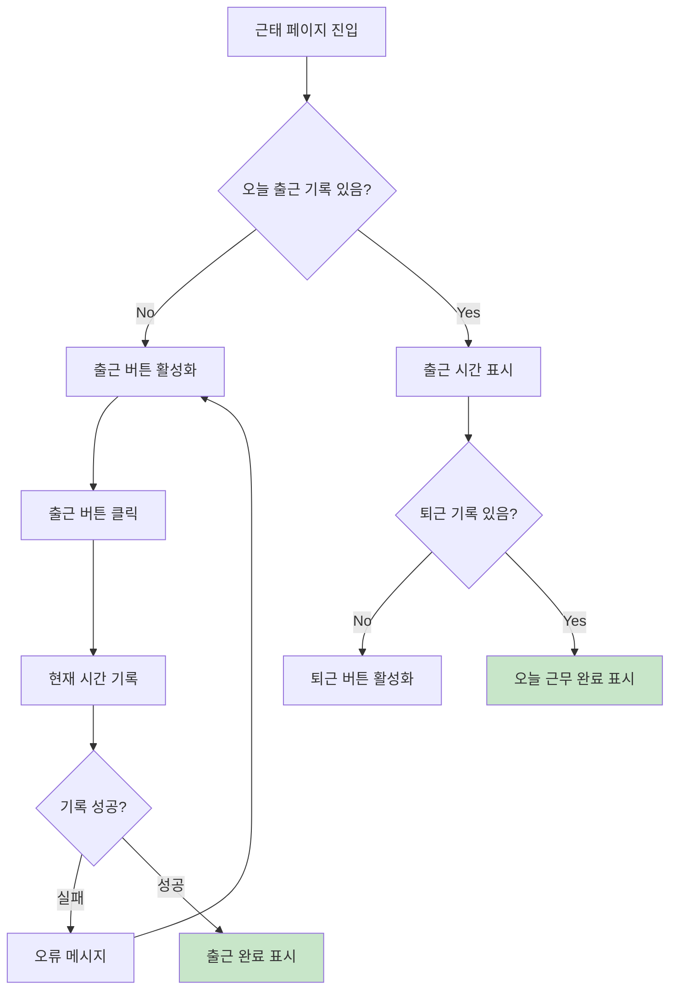
```mermaid
graph TD
    A[근태 페이지 진입] --> B{오늘 출근 기록 있음?}

    B -->|No| C[출근 버튼 활성화]
    C --> D[출근 버튼 클릭]
    D --> E[현재 시간 기록]
    E --> F{기록 성공?}
    F -->|실패| G[오류 메시지]
    G --> C
    F -->|성공| H[출근 완료 표시]

    B -->|Yes| I[출근 시간 표시]
    I --> J{퇴근 기록 있음?}
    J -->|No| K[퇴근 버튼 활성화]
    J -->|Yes| L[오늘 근무 완료 표시]

    style H fill:#c8e6c9
    style L fill:#c8e6c9
```

### 4.2 퇴근 기록

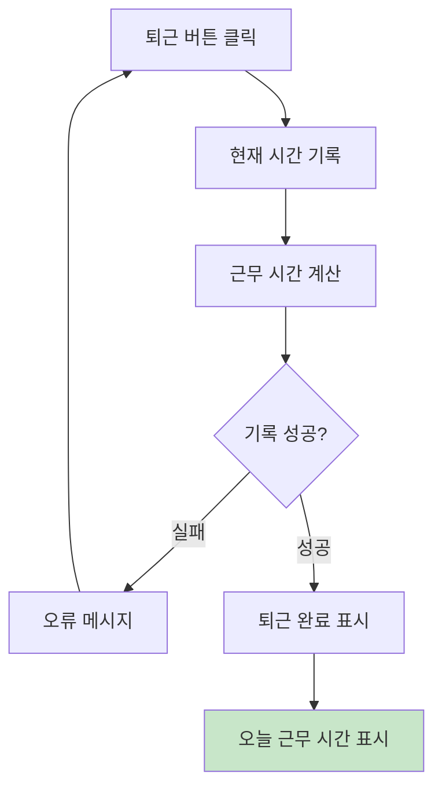
```mermaid
graph TD
    A[퇴근 버튼 클릭] --> B[현재 시간 기록]
    B --> C[근무 시간 계산]
    C --> D{기록 성공?}
    D -->|실패| E[오류 메시지]
    E --> A
    D -->|성공| F[퇴근 완료 표시]
    F --> G[오늘 근무 시간 표시]

    style G fill:#c8e6c9
```

### 4.3 근태 현황 조회

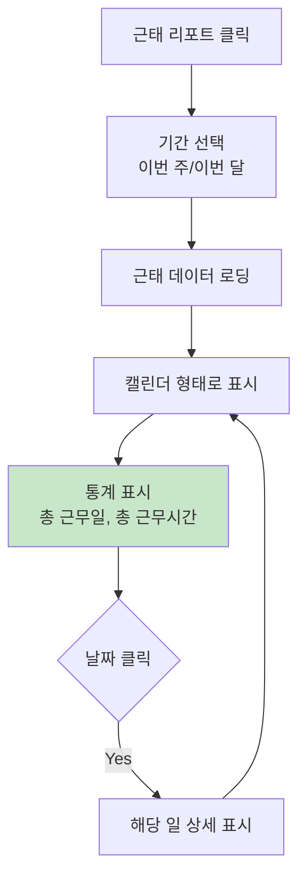
```mermaid
graph TD
    A[근태 리포트 클릭] --> B[기간 선택<br/>이번 주/이번 달]
    B --> C[근태 데이터 로딩]
    C --> D[캘린더 형태로 표시]
    D --> E[통계 표시<br/>총 근무일, 총 근무시간]

    E --> F{날짜 클릭}
    F -->|Yes| G[해당 일 상세 표시]
    G --> D

    style E fill:#c8e6c9
```

---

## 5. FEAT-3: 팀 캘린더/일정 흐름

### 5.1 일정 조회

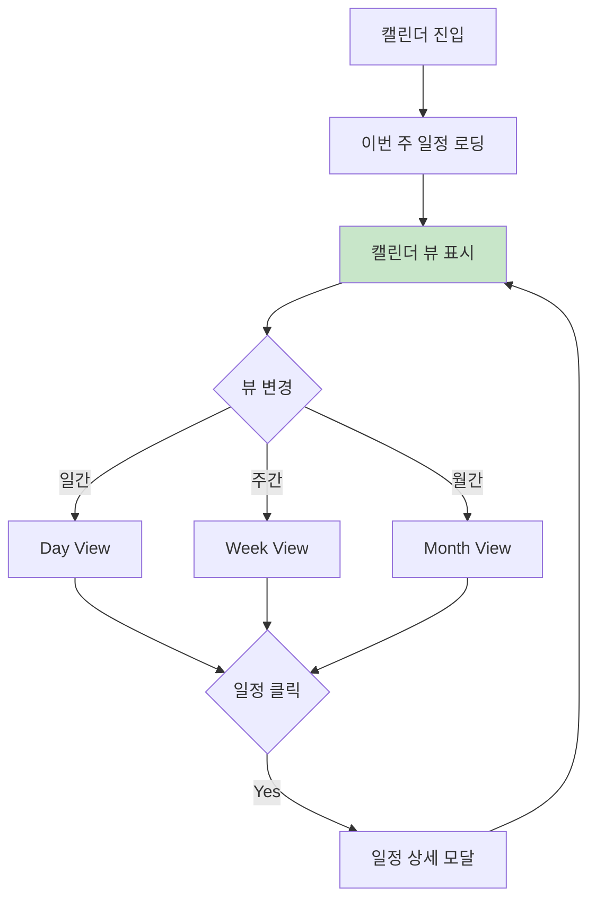
```mermaid
graph TD
    A[캘린더 진입] --> B[이번 주 일정 로딩]
    B --> C[캘린더 뷰 표시]

    C --> D{뷰 변경}
    D -->|일간| E[Day View]
    D -->|주간| F[Week View]
    D -->|월간| G[Month View]

    E --> H{일정 클릭}
    F --> H
    G --> H

    H -->|Yes| I[일정 상세 모달]
    I --> C

    style C fill:#c8e6c9
```

### 5.2 일정 생성

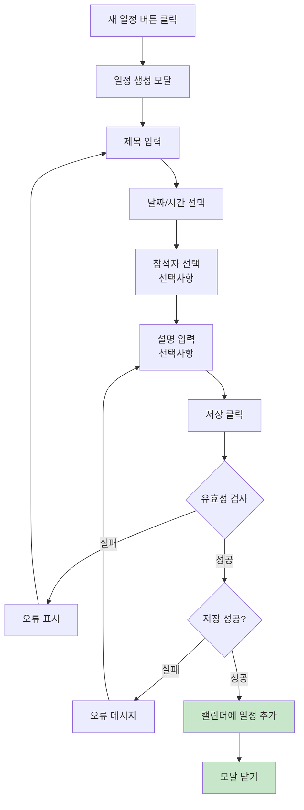
```mermaid
graph TD
    A[새 일정 버튼 클릭] --> B[일정 생성 모달]
    B --> C[제목 입력]
    C --> D[날짜/시간 선택]
    D --> E[참석자 선택<br/>선택사항]
    E --> F[설명 입력<br/>선택사항]

    F --> G[저장 클릭]
    G --> H{유효성 검사}
    H -->|실패| I[오류 표시]
    I --> C

    H -->|성공| J{저장 성공?}
    J -->|실패| K[오류 메시지]
    K --> F
    J -->|성공| L[캘린더에 일정 추가]
    L --> M[모달 닫기]

    style L fill:#c8e6c9
    style M fill:#c8e6c9
```

---

## 6. 설정 흐름

### 6.1 프로필 수정

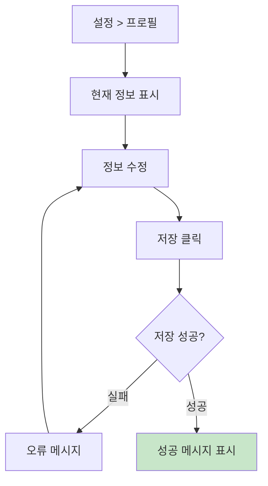
```mermaid
graph TD
    A[설정 > 프로필] --> B[현재 정보 표시]
    B --> C[정보 수정]
    C --> D[저장 클릭]
    D --> E{저장 성공?}
    E -->|실패| F[오류 메시지]
    F --> C
    E -->|성공| G[성공 메시지 표시]

    style G fill:#c8e6c9
```

### 6.2 비밀번호 변경

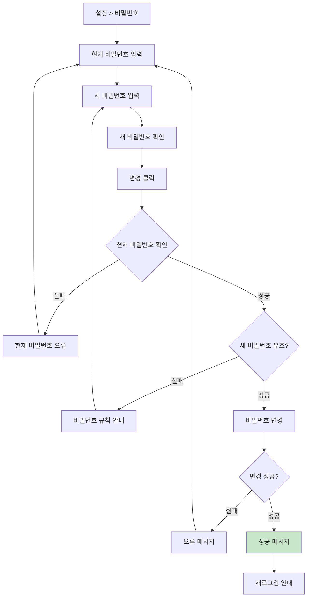
```mermaid
graph TD
    A[설정 > 비밀번호] --> B[현재 비밀번호 입력]
    B --> C[새 비밀번호 입력]
    C --> D[새 비밀번호 확인]
    D --> E[변경 클릭]

    E --> F{현재 비밀번호 확인}
    F -->|실패| G[현재 비밀번호 오류]
    G --> B

    F -->|성공| H{새 비밀번호 유효?}
    H -->|실패| I[비밀번호 규칙 안내]
    I --> C

    H -->|성공| J[비밀번호 변경]
    J --> K{변경 성공?}
    K -->|실패| L[오류 메시지]
    L --> B
    K -->|성공| M[성공 메시지]
    M --> N[재로그인 안내]

    style M fill:#c8e6c9
```

---

## 7. 오류 처리 흐름

### 7.1 네트워크 오류

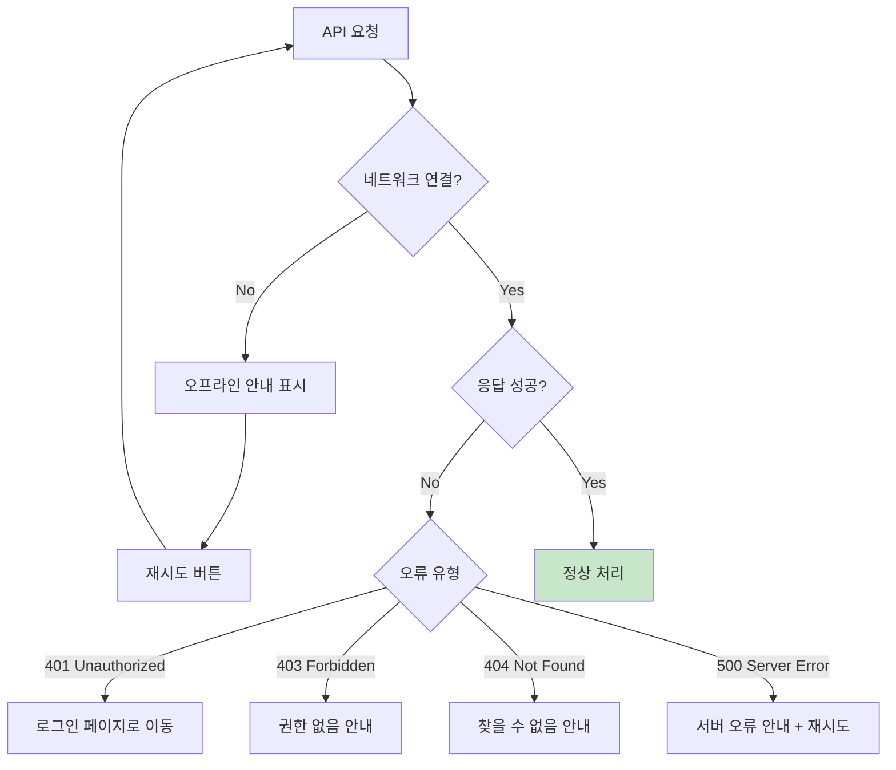
```mermaid
graph TD
    A[API 요청] --> B{네트워크 연결?}
    B -->|No| C[오프라인 안내 표시]
    C --> D[재시도 버튼]
    D --> A

    B -->|Yes| E{응답 성공?}
    E -->|No| F{오류 유형}

    F -->|401 Unauthorized| G[로그인 페이지로 이동]
    F -->|403 Forbidden| H[권한 없음 안내]
    F -->|404 Not Found| I[찾을 수 없음 안내]
    F -->|500 Server Error| J[서버 오류 안내 + 재시도]

    E -->|Yes| K[정상 처리]

    style K fill:#c8e6c9
```

---

## 8. 온보딩 → 핵심 작업 → 리텐션 루프

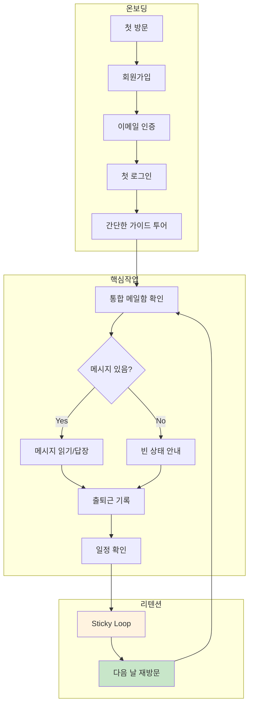
```mermaid
graph TD
    subgraph 온보딩
        A[첫 방문] --> B[회원가입]
        B --> C[이메일 인증]
        C --> D[첫 로그인]
        D --> E[간단한 가이드 투어]
    end

    subgraph 핵심작업
        E --> F[통합 메일함 확인]
        F --> G{메시지 있음?}
        G -->|Yes| H[메시지 읽기/답장]
        G -->|No| I[빈 상태 안내]

        H --> J[출퇴근 기록]
        I --> J
        J --> K[일정 확인]
    end

    subgraph 리텐션
        K --> L[Sticky Loop]
        L --> M[다음 날 재방문]
        M --> F
    end

    style L fill:#fff3e0
    style M fill:#c8e6c9
```

### Sticky Loop 구성 요소

| 요소 | 설명 | 트리거 |
|------|------|--------|
| 미확인 배지 | 안읽은 메시지 수 표시 | 새 메시지 수신 시 |
| 오늘 할 일 | 대시보드에 오늘 일정 표시 | 로그인 시 |
| 출퇴근 리마인더 | 출근 미기록 시 알림 | 오전 시간대 |
| 주간 리포트 | 이번 주 근무 시간 요약 | 금요일 |

---

## 부록: 화면별 상태 정의

### 메시지 목록 상태

| 상태 | 조건 | UI 표현 |
|------|------|---------|
| 로딩 | 데이터 요청 중 | 스켈레톤 UI |
| 빈 상태 | 메시지 0개 | 빈 상태 일러스트 + 안내 |
| 정상 | 메시지 1개 이상 | 메시지 리스트 |
| 오류 | 요청 실패 | 오류 메시지 + 재시도 |
| 검색 결과 없음 | 검색 결과 0개 | 검색어 안내 + 초기화 |

### 인증 상태

| 상태 | 조건 | UI 표현 |
|------|------|---------|
| 비로그인 | 세션 없음 | 로그인 페이지 리다이렉트 |
| 로그인 | 세션 유효 | 정상 접근 |
| 세션 만료 | 토큰 만료 | 재로그인 모달 |
