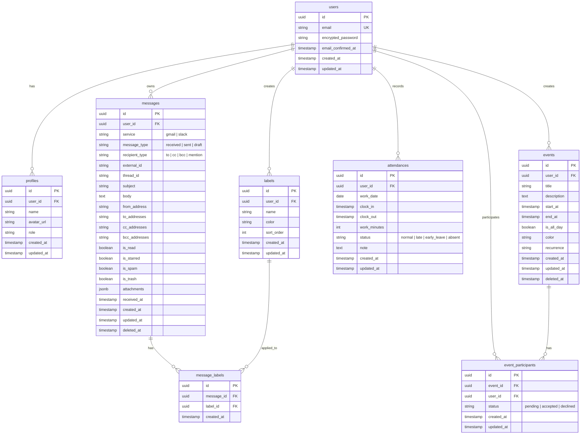

# Database Design (데이터베이스 설계)

> **프로젝트명:** 팀메이트
> **버전:** v1.0
> **작성일:** 2025-01-28
> **데이터베이스:** PostgreSQL (Supabase)

---

## 1. ERD (Entity Relationship Diagram)



---

## 2. 테이블 상세 정의

### 2.1 users (사용자)

> Supabase Auth에서 자동 관리되는 테이블. 직접 수정하지 않음.

| 컬럼 | 타입 | 제약조건 | 설명 |
|------|------|----------|------|
| id | uuid | PK | 사용자 고유 ID |
| email | varchar(255) | UNIQUE, NOT NULL | 이메일 주소 |
| encrypted_password | varchar | NOT NULL | 암호화된 비밀번호 |
| email_confirmed_at | timestamptz | - | 이메일 인증 완료 시각 |
| created_at | timestamptz | NOT NULL | 가입 시각 |
| updated_at | timestamptz | NOT NULL | 수정 시각 |

---

### 2.2 profiles (프로필)

> 사용자 추가 정보. users 테이블과 1:1 관계.

| 컬럼 | 타입 | 제약조건 | 설명 |
|------|------|----------|------|
| id | uuid | PK, DEFAULT uuid_generate_v4() | 프로필 ID |
| user_id | uuid | FK → users.id, UNIQUE | 사용자 ID |
| name | varchar(100) | NOT NULL | 이름 |
| avatar_url | varchar(500) | - | 프로필 이미지 URL |
| role | varchar(20) | DEFAULT 'member' | 역할 (member/manager/admin) |
| created_at | timestamptz | DEFAULT now() | 생성 시각 |
| updated_at | timestamptz | DEFAULT now() | 수정 시각 |

**인덱스:**
- `idx_profiles_user_id` ON (user_id)

**RLS 정책:**
```sql
-- 본인 프로필 조회 가능
CREATE POLICY "Users can view own profile"
ON profiles FOR SELECT
USING (auth.uid() = user_id);

-- 본인 프로필 수정 가능
CREATE POLICY "Users can update own profile"
ON profiles FOR UPDATE
USING (auth.uid() = user_id);
```

---

### 2.3 messages (메시지) - FEAT-1

> 통합 메일함의 핵심 테이블. Gmail/Slack 메시지 통합 저장.

| 컬럼 | 타입 | 제약조건 | 설명 |
|------|------|----------|------|
| id | uuid | PK, DEFAULT uuid_generate_v4() | 메시지 ID |
| user_id | uuid | FK → users.id, NOT NULL | 소유자 ID |
| service | varchar(10) | NOT NULL | 서비스 (gmail/slack) |
| message_type | varchar(10) | NOT NULL | 유형 (received/sent/draft) |
| recipient_type | varchar(10) | - | 수신 유형 (to/cc/bcc/mention) |
| external_id | varchar(255) | - | 외부 서비스 ID |
| thread_id | varchar(255) | - | 스레드 ID (그룹화용) |
| subject | varchar(500) | - | 제목 (Gmail용) |
| body | text | - | 본문 내용 |
| from_address | varchar(255) | - | 발신자 |
| to_addresses | jsonb | DEFAULT '[]' | 수신자 목록 |
| cc_addresses | jsonb | DEFAULT '[]' | 참조 목록 |
| bcc_addresses | jsonb | DEFAULT '[]' | 숨은 참조 목록 |
| is_read | boolean | DEFAULT false | 읽음 여부 |
| is_starred | boolean | DEFAULT false | 별표 여부 |
| is_spam | boolean | DEFAULT false | 스팸 여부 |
| is_trash | boolean | DEFAULT false | 휴지통 여부 |
| attachments | jsonb | DEFAULT '[]' | 첨부파일 정보 |
| received_at | timestamptz | - | 수신 시각 |
| created_at | timestamptz | DEFAULT now() | 생성 시각 |
| updated_at | timestamptz | DEFAULT now() | 수정 시각 |
| deleted_at | timestamptz | - | 삭제 시각 (Soft Delete) |

**인덱스:**
```sql
CREATE INDEX idx_messages_user_id ON messages(user_id);
CREATE INDEX idx_messages_service ON messages(service);
CREATE INDEX idx_messages_is_read ON messages(is_read);
CREATE INDEX idx_messages_received_at ON messages(received_at DESC);
CREATE INDEX idx_messages_thread_id ON messages(thread_id);
CREATE INDEX idx_messages_deleted_at ON messages(deleted_at) WHERE deleted_at IS NULL;
```

**RLS 정책:**
```sql
-- 본인 메시지만 조회
CREATE POLICY "Users can view own messages"
ON messages FOR SELECT
USING (auth.uid() = user_id AND deleted_at IS NULL);

-- 본인 메시지 생성
CREATE POLICY "Users can insert own messages"
ON messages FOR INSERT
WITH CHECK (auth.uid() = user_id);

-- 본인 메시지 수정
CREATE POLICY "Users can update own messages"
ON messages FOR UPDATE
USING (auth.uid() = user_id);
```

---

### 2.4 labels (라벨)

> 사용자 정의 라벨. 메시지 분류용.

| 컬럼 | 타입 | 제약조건 | 설명 |
|------|------|----------|------|
| id | uuid | PK, DEFAULT uuid_generate_v4() | 라벨 ID |
| user_id | uuid | FK → users.id, NOT NULL | 소유자 ID |
| name | varchar(50) | NOT NULL | 라벨 이름 |
| color | varchar(20) | DEFAULT '#6B7280' | 라벨 색상 (HEX) |
| sort_order | integer | DEFAULT 0 | 정렬 순서 |
| created_at | timestamptz | DEFAULT now() | 생성 시각 |
| updated_at | timestamptz | DEFAULT now() | 수정 시각 |

**제약조건:**
```sql
-- 동일 사용자 내 라벨 이름 중복 불가
ALTER TABLE labels ADD CONSTRAINT unique_label_name_per_user
UNIQUE (user_id, name);
```

**인덱스:**
- `idx_labels_user_id` ON (user_id)

---

### 2.5 message_labels (메시지-라벨 연결)

> 메시지와 라벨의 다대다 관계 테이블.

| 컬럼 | 타입 | 제약조건 | 설명 |
|------|------|----------|------|
| id | uuid | PK, DEFAULT uuid_generate_v4() | ID |
| message_id | uuid | FK → messages.id, NOT NULL | 메시지 ID |
| label_id | uuid | FK → labels.id, NOT NULL | 라벨 ID |
| created_at | timestamptz | DEFAULT now() | 생성 시각 |

**제약조건:**
```sql
-- 중복 연결 방지
ALTER TABLE message_labels ADD CONSTRAINT unique_message_label
UNIQUE (message_id, label_id);
```

**인덱스:**
- `idx_message_labels_message_id` ON (message_id)
- `idx_message_labels_label_id` ON (label_id)

---

### 2.6 attendances (근태 기록) - FEAT-2

> 출퇴근 기록. 일자별 1개 레코드.

| 컬럼 | 타입 | 제약조건 | 설명 |
|------|------|----------|------|
| id | uuid | PK, DEFAULT uuid_generate_v4() | 기록 ID |
| user_id | uuid | FK → users.id, NOT NULL | 사용자 ID |
| work_date | date | NOT NULL | 근무 일자 |
| clock_in | timestamptz | - | 출근 시각 |
| clock_out | timestamptz | - | 퇴근 시각 |
| work_minutes | integer | - | 근무 시간 (분) |
| status | varchar(20) | DEFAULT 'normal' | 상태 |
| note | text | - | 비고 |
| created_at | timestamptz | DEFAULT now() | 생성 시각 |
| updated_at | timestamptz | DEFAULT now() | 수정 시각 |

**상태 값:**
- `normal`: 정상 출근
- `late`: 지각
- `early_leave`: 조퇴
- `absent`: 결근

**제약조건:**
```sql
-- 동일 사용자, 동일 일자 중복 불가
ALTER TABLE attendances ADD CONSTRAINT unique_attendance_per_day
UNIQUE (user_id, work_date);
```

**인덱스:**
```sql
CREATE INDEX idx_attendances_user_id ON attendances(user_id);
CREATE INDEX idx_attendances_work_date ON attendances(work_date DESC);
CREATE INDEX idx_attendances_user_date ON attendances(user_id, work_date);
```

**RLS 정책:**
```sql
-- 본인 근태 조회
CREATE POLICY "Users can view own attendance"
ON attendances FOR SELECT
USING (auth.uid() = user_id);

-- 본인 근태 기록
CREATE POLICY "Users can insert own attendance"
ON attendances FOR INSERT
WITH CHECK (auth.uid() = user_id);

-- 본인 근태 수정
CREATE POLICY "Users can update own attendance"
ON attendances FOR UPDATE
USING (auth.uid() = user_id);
```

---

### 2.7 events (일정) - FEAT-3

> 팀 캘린더 일정.

| 컬럼 | 타입 | 제약조건 | 설명 |
|------|------|----------|------|
| id | uuid | PK, DEFAULT uuid_generate_v4() | 일정 ID |
| user_id | uuid | FK → users.id, NOT NULL | 생성자 ID |
| title | varchar(200) | NOT NULL | 일정 제목 |
| description | text | - | 설명 |
| start_at | timestamptz | NOT NULL | 시작 시각 |
| end_at | timestamptz | NOT NULL | 종료 시각 |
| is_all_day | boolean | DEFAULT false | 종일 일정 여부 |
| color | varchar(20) | DEFAULT '#3B82F6' | 표시 색상 |
| recurrence | varchar(50) | - | 반복 규칙 (Phase 2+) |
| created_at | timestamptz | DEFAULT now() | 생성 시각 |
| updated_at | timestamptz | DEFAULT now() | 수정 시각 |
| deleted_at | timestamptz | - | 삭제 시각 |

**인덱스:**
```sql
CREATE INDEX idx_events_user_id ON events(user_id);
CREATE INDEX idx_events_start_at ON events(start_at);
CREATE INDEX idx_events_date_range ON events(start_at, end_at);
```

---

### 2.8 event_participants (일정 참석자)

> 일정과 참석자의 다대다 관계.

| 컬럼 | 타입 | 제약조건 | 설명 |
|------|------|----------|------|
| id | uuid | PK, DEFAULT uuid_generate_v4() | ID |
| event_id | uuid | FK → events.id, NOT NULL | 일정 ID |
| user_id | uuid | FK → users.id, NOT NULL | 참석자 ID |
| status | varchar(20) | DEFAULT 'pending' | 참석 상태 |
| created_at | timestamptz | DEFAULT now() | 생성 시각 |
| updated_at | timestamptz | DEFAULT now() | 수정 시각 |

**상태 값:**
- `pending`: 응답 대기
- `accepted`: 수락
- `declined`: 거절

**제약조건:**
```sql
ALTER TABLE event_participants ADD CONSTRAINT unique_event_participant
UNIQUE (event_id, user_id);
```

---

## 3. Mock 데이터 구조

MVP 단계에서는 외부 API 연동 없이 Mock 데이터 사용.

### 3.1 messages.mock.json

```json
{
  "messages": [
    {
      "id": "msg-001",
      "service": "gmail",
      "message_type": "received",
      "recipient_type": "to",
      "subject": "프로젝트 회의 안건",
      "body": "안녕하세요, 다음 주 회의 안건을 공유드립니다...",
      "from_address": "kim@example.com",
      "to_addresses": ["me@company.com"],
      "is_read": false,
      "is_starred": false,
      "attachments": [],
      "received_at": "2025-01-28T09:00:00Z"
    },
    {
      "id": "msg-002",
      "service": "slack",
      "message_type": "received",
      "recipient_type": "mention",
      "subject": null,
      "body": "@지민 님, 디자인 리뷰 부탁드려요!",
      "from_address": "박현수",
      "to_addresses": [],
      "is_read": true,
      "is_starred": false,
      "attachments": [],
      "received_at": "2025-01-28T10:30:00Z"
    }
  ]
}
```

### 3.2 labels.mock.json

```json
{
  "labels": [
    {
      "id": "label-001",
      "name": "중요",
      "color": "#EF4444",
      "sort_order": 1
    },
    {
      "id": "label-002",
      "name": "업무",
      "color": "#3B82F6",
      "sort_order": 2
    },
    {
      "id": "label-003",
      "name": "개인",
      "color": "#10B981",
      "sort_order": 3
    }
  ]
}
```

---

## 4. 데이터베이스 함수 (Stored Procedures)

### 4.1 출근 기록 함수

```sql
CREATE OR REPLACE FUNCTION clock_in(p_user_id uuid)
RETURNS attendances AS $$
DECLARE
  v_today date := CURRENT_DATE;
  v_now timestamptz := now();
  v_record attendances;
BEGIN
  -- 오늘 기록이 이미 있는지 확인
  SELECT * INTO v_record
  FROM attendances
  WHERE user_id = p_user_id AND work_date = v_today;

  IF v_record.id IS NOT NULL THEN
    RAISE EXCEPTION 'Already clocked in today';
  END IF;

  -- 새 출근 기록 생성
  INSERT INTO attendances (user_id, work_date, clock_in, status)
  VALUES (p_user_id, v_today, v_now, 'normal')
  RETURNING * INTO v_record;

  RETURN v_record;
END;
$$ LANGUAGE plpgsql SECURITY DEFINER;
```

### 4.2 퇴근 기록 함수

```sql
CREATE OR REPLACE FUNCTION clock_out(p_user_id uuid)
RETURNS attendances AS $$
DECLARE
  v_today date := CURRENT_DATE;
  v_now timestamptz := now();
  v_record attendances;
  v_work_minutes integer;
BEGIN
  -- 오늘 출근 기록 확인
  SELECT * INTO v_record
  FROM attendances
  WHERE user_id = p_user_id AND work_date = v_today;

  IF v_record.id IS NULL THEN
    RAISE EXCEPTION 'No clock-in record found for today';
  END IF;

  IF v_record.clock_out IS NOT NULL THEN
    RAISE EXCEPTION 'Already clocked out today';
  END IF;

  -- 근무 시간 계산 (분 단위)
  v_work_minutes := EXTRACT(EPOCH FROM (v_now - v_record.clock_in)) / 60;

  -- 퇴근 기록 업데이트
  UPDATE attendances
  SET clock_out = v_now,
      work_minutes = v_work_minutes,
      updated_at = v_now
  WHERE id = v_record.id
  RETURNING * INTO v_record;

  RETURN v_record;
END;
$$ LANGUAGE plpgsql SECURITY DEFINER;
```

---

## 5. 마이그레이션 순서

1. **users** - Supabase Auth 자동 생성
2. **profiles** - users 생성 시 트리거로 자동 생성
3. **labels** - 사용자별 라벨
4. **messages** - 통합 메시지
5. **message_labels** - 메시지-라벨 연결
6. **attendances** - 근태 기록
7. **events** - 일정
8. **event_participants** - 일정 참석자

---

## 6. 프로필 자동 생성 트리거

```sql
-- 사용자 생성 시 프로필 자동 생성
CREATE OR REPLACE FUNCTION handle_new_user()
RETURNS trigger AS $$
BEGIN
  INSERT INTO public.profiles (user_id, name, role)
  VALUES (
    NEW.id,
    COALESCE(NEW.raw_user_meta_data->>'name', split_part(NEW.email, '@', 1)),
    'member'
  );
  RETURN NEW;
END;
$$ LANGUAGE plpgsql SECURITY DEFINER;

CREATE TRIGGER on_auth_user_created
  AFTER INSERT ON auth.users
  FOR EACH ROW EXECUTE FUNCTION handle_new_user();
```

---

## 부록: 타입 정의 (TypeScript)

```typescript
// types/database.ts

export interface User {
  id: string;
  email: string;
  created_at: string;
}

export interface Profile {
  id: string;
  user_id: string;
  name: string;
  avatar_url: string | null;
  role: 'member' | 'manager' | 'admin';
  created_at: string;
  updated_at: string;
}

export interface Message {
  id: string;
  user_id: string;
  service: 'gmail' | 'slack';
  message_type: 'received' | 'sent' | 'draft';
  recipient_type: 'to' | 'cc' | 'bcc' | 'mention' | null;
  external_id: string | null;
  thread_id: string | null;
  subject: string | null;
  body: string | null;
  from_address: string | null;
  to_addresses: string[];
  cc_addresses: string[];
  bcc_addresses: string[];
  is_read: boolean;
  is_starred: boolean;
  is_spam: boolean;
  is_trash: boolean;
  attachments: Attachment[];
  received_at: string | null;
  created_at: string;
  updated_at: string;
  deleted_at: string | null;
}

export interface Attachment {
  id: string;
  name: string;
  size: number;
  type: string;
  url: string;
}

export interface Label {
  id: string;
  user_id: string;
  name: string;
  color: string;
  sort_order: number;
  created_at: string;
  updated_at: string;
}

export interface Attendance {
  id: string;
  user_id: string;
  work_date: string;
  clock_in: string | null;
  clock_out: string | null;
  work_minutes: number | null;
  status: 'normal' | 'late' | 'early_leave' | 'absent';
  note: string | null;
  created_at: string;
  updated_at: string;
}

export interface Event {
  id: string;
  user_id: string;
  title: string;
  description: string | null;
  start_at: string;
  end_at: string;
  is_all_day: boolean;
  color: string;
  recurrence: string | null;
  created_at: string;
  updated_at: string;
  deleted_at: string | null;
}

export interface EventParticipant {
  id: string;
  event_id: string;
  user_id: string;
  status: 'pending' | 'accepted' | 'declined';
  created_at: string;
  updated_at: string;
}
```
